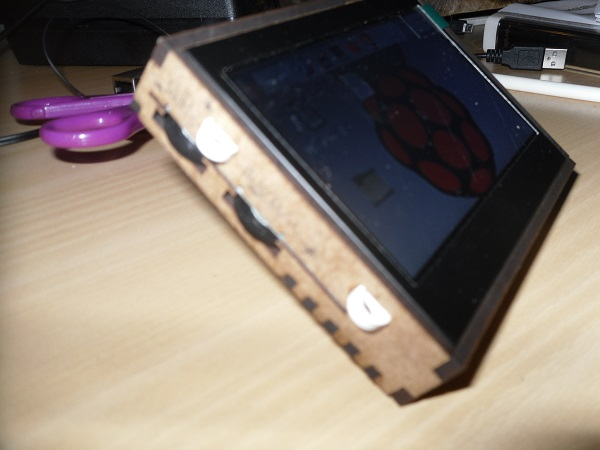
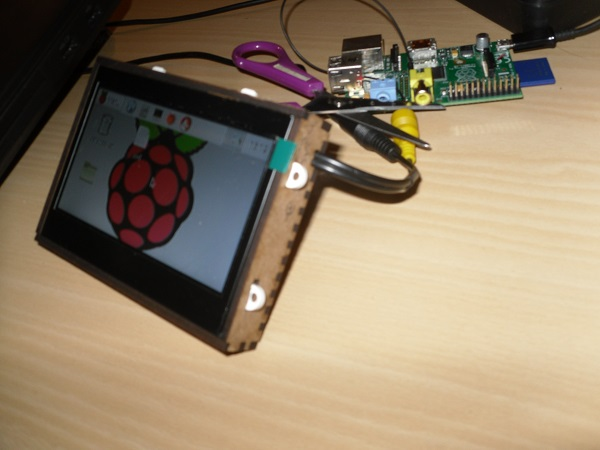

Pollin 4.3 Zoll Display Set Hülle zum Lasercutten
=================================================

Material: 

- 3mm dickes Acryl oder Holz

Links:
- [Display](http://www.pollin.de/shop/dt/NDgwOTc4OTk-/Bauelemente_Bauteile/Aktive_Bauelemente/Displays/4_3_10_9_cm_Display_Set_JD43T30_C_MEX043TM_40D_HYO_CO_CVBS.html)
- [Anschalten des Compositevideoausgangs](../raspberry_pi_composite_display)