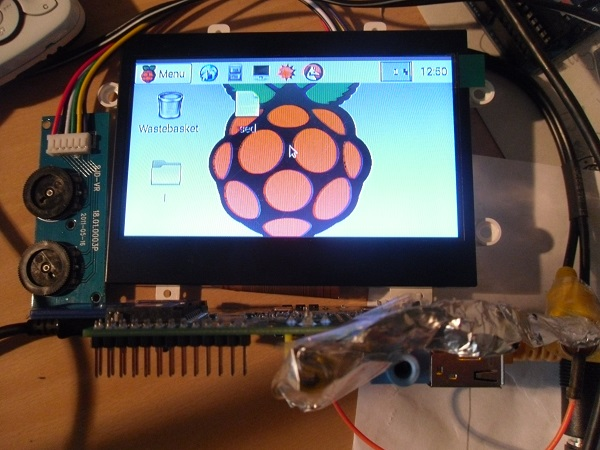

# Raspberry Pi mit Composite Video und Pollins 4.3" (10,9 cm) Display-Set

`/boot/config.txt`:

    # For more options and information see
    # http://www.raspberrypi.org/documentation/configuration/config-txt.md
    # Some settings may impact device functionality. See link above for details
    
    # uncomment if you get no picture on HDMI for a default "safe" mode
    #hdmi_safe=1
    
    # uncomment this if your display has a black border of unused pixels visible
    # and your display can output without overscan
    #disable_overscan=1
    
    # uncomment the following to adjust overscan. Use positive numbers if console
    # goes off screen, and negative if there is too much border
    #overscan_left=16
    #overscan_right=16
    #overscan_top=16
    #overscan_bottom=16
    
    # uncomment to force a console size. By default it will be display's size minus
    # overscan.
    framebuffer_width=480
    framebuffer_height=272
    
    # uncomment if hdmi display is not detected and composite is being output
    hdmi_force_hotplug=0
    
    # uncomment to force a specific HDMI mode (this will force VGA)
    #hdmi_group=1
    #hdmi_mode=1
    
    # uncomment to force a HDMI mode rather than DVI. This can make audio work in
    # DMT (computer monitor) modes
    #hdmi_drive=2
    
    # uncomment to increase signal to HDMI, if you have interference, blanking, or
    # no display
    #config_hdmi_boost=4
    
    # uncomment for composite PAL
    # sdtv_mode=2
    sdtv_mode=0
    
    # added by nicco: aspect ratio
    sdtv_aspect=3
    
    #uncomment to overclock the arm. 700 MHz is the default.
    #arm_freq=800
    
    
    # NOOBS Auto-generated Settings:
    #hdmi_force_hotplug=1
    #config_hdmi_boost=4
    overscan_left=-24
    overscan_right=-24
    overscan_top=-16
    overscan_bottom=-16
    disable_overscan=0

To edit the file:

1. Open terminal
2. type

       sudo nano /boot/config.txt

3. change the lines necessary
4. Control+o & Return saves the file
5. Control+X closes the file
6. Restart

Links: 

- [Pollin](http://www.pollin.de/shop/dt/NDgwOTc4OTk-/Bauelemente_Bauteile/Aktive_Bauelemente/Displays/4_3_10_9_cm_Display_Set_JD43T30_C_MEX043TM_40D_HYO_CO_CVBS.html)
- [config text file](https://www.raspberrypi.org/documentation/configuration/config-txt.md)
- [Stackexchange](http://raspberrypi.stackexchange.com/questions/13803/how-to-override-config-txt-settings-during-boot)
- [Displayhülle](../4.3_inch_display_set_hull)
